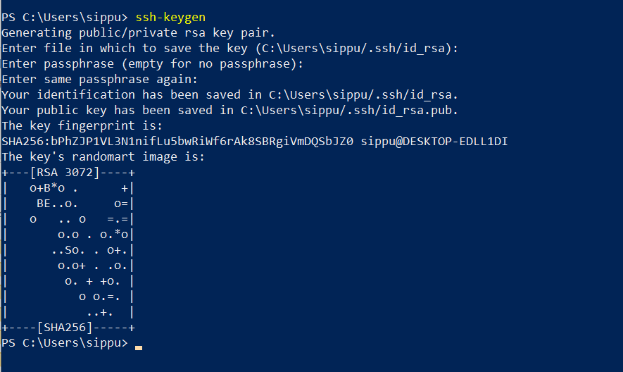

# GitHub でのリポジトリ管理

## Organization を作成する
新しくプロジェクトを作り、リポジトリをグループでまとめるときは Organization を作成する。

1. 右上のユーザーアイコンをクリックする。

2. [Your organizations] を選択する。

3. [New organization] を選択する。

4. 以下を入力する
   * 組織名
   * 責任者のメールアドレス
   * 所属: My personal account 

## Organization へユーザーを追加する
※ 事前に個別メンバーのGitHubアカウントを作っておいたほうが楽になる。

1. [People] を選択する。

2. [Invite member] を選択する。

3. 招待するユーザーのGitHubアカウント名、またはメールアドレスを入力して [Invite] をクリックする。

4. 権限を選ぶ
mainブランチへのマージを行う人は Owner 、それ以外は Member を選択する。

※ メンバーの権限は後から変更できる。

5. メンバーに招待メールが届くのでリンクから参加する。

## リポジトリを作成する
割愛

## 自分のアカウントにSSHキーを登録する
1. ユーザーアイコンのメニューから [Settings] を選択する。

2. [SSH and GPG keys] を選択する。

3. [New SSH key] をクリックする。

4. 以下の情報を入力して登録する。
   * Titile: 任意の名前
   * Key type: Authentication key
   * Key: SSH公開鍵の内容

SSH公開鍵を作成していない場合は、次の手順で作成する。

### SSHキーペアを生成する

1. Windows Powershell を開き、`ssh-keygen` コマンドを入力する。途中で聞かれる質問はすべてEnterで返してよい。

2. SSH公開鍵および秘密鍵はデフォルトでは `C:/Users/(username)/.ssh/` に作成される。
   * 秘密鍵: `id_rsa`
   * 公開鍵: `id_rsa.pub`  <- こちらをGitHubへ登録
